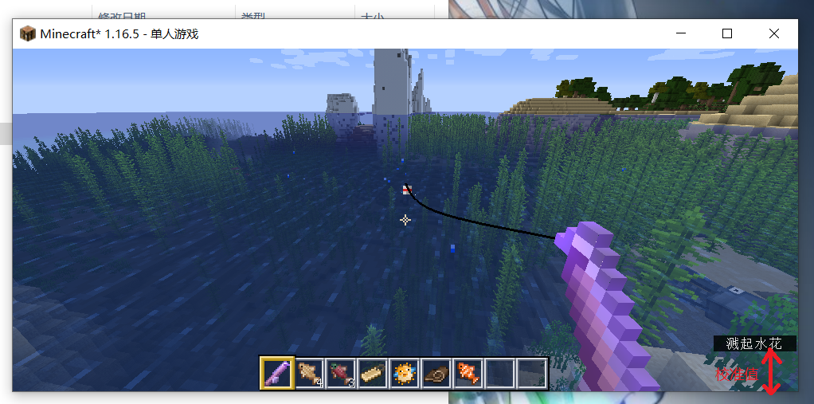

# openfish
minecraft 钓鱼脚本

## fishing-win.py 为windows可用的后台挂机版本
脚本特点：
```
1、仅支持windows系统后台挂机使用
2、可以重新校准
3、打包好的exe文件在dist目录下
```
使用方法：
```
1、在minecraft界面输入 F3+P 失去焦距
2、打开脚本，选择必要的选项
3、如需校准，会弹出截图界面，请确保截图区域右下角刚好对准文本区域右下角
```
校准值示意图：



正确的截图示例：


提高识别准确率方法：
夜晚请在身边插火把提高亮度！！！！！


## 依赖环境安装参考
Python 版本不能高于 3.7.9 ！！！！！！！！！！！！！ 

```
pip3 install -r requirements.txt -i https://pypi.tuna.tsinghua.edu.cn/simple
```

## fishing.py 为简易通用版本

    可适用所有机器
    使用传统文本区域检测方法
    使用cnocr识别文本
    使用pyautogui控制屏幕鼠标 
        有一定概率鼠标被屏蔽
        全屏下无法截图
        键盘被屏蔽
    打包好的exe文件在dist目录下

### 计划将要支持：
    mser算法之后的文本框选择方法有待改进
    任意窗口大小检测计算
    反钓鱼脚本检测


